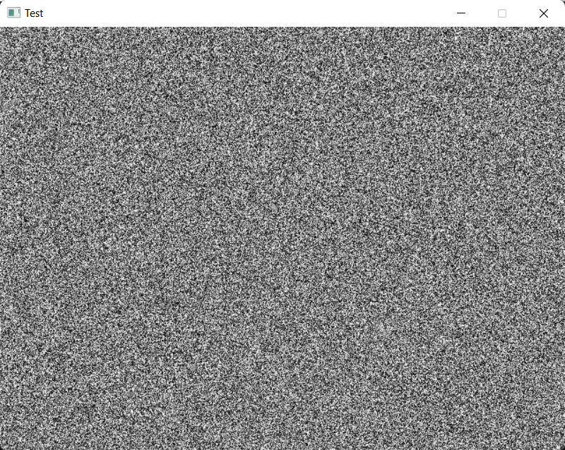

# Software Render Test

A simple test program that renders a static-like effect by drawing random bytes to a texture and then copying the texture to the canvas.

The reason I wrote this program is to create a reusable library (drawing.rs) that I can use for learning purposes, specifically while reading the book *Computer Graphics From Scratch* by Gabriel Gambetta.

## Running The Code

To run the code, make sure you have your Rust development environment set up, clone the repository, copy `SDL2.dll` into the repo folder and run the command `cargo run --release`.

`SDL2.dll` can be obtained from the SDL development libraries at [libSDL.org](https://www.libsdl.org/download-2.0.php).
Further instructions on how to install SDL2 can be found at [crates.io](https://crates.io/crates/sdl2).

